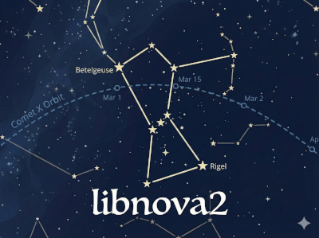

# libnova2

<div align="center">
  
  <br />
  <a href="https://github.com/lgirdwood/libnova2/actions/workflows/ci.yml"></a>
</div>

**libnova2** is a general purpose, double precision, Celestial Mechanics, Astrometry and Astrodynamics library. It is a successor to libnova with the significant change being use of radians instead of degrees.

## Features

-   **High Precision**: 1 arc second or better.
-   **Ephemerides**:
    -   Major Planets: Mercury, Venus, Earth, Mars, Jupiter, Saturn, Uranus, Neptune, Pluto.
    -   Sun & Moon (ELP82).
    -   Minor Bodies: Asteroids and Comets.
-   **Astrometry**:
    -   Aberration, Nutation, Precession, Proper Motion.
    -   Refraction, Parallax, Airmass.
-   **Time Systems**:
    -   Julian Day, Sidereal Time, Dynamical Time, Heliocentric Time.
-   **Coordinates**:
    -   Transformations: Equatorial, Ecliptic, Horizontal, Galactic.
    -   Rise, Set, and Transit times.
    -   Angular Separation.

## Requirements

-   C compiler (GCC, Clang, MSVC)
-   CMake (3.25 or later)
-   **Optional**:
    -   `kconfig-frontends` (for `menuconfig` configuration)
    -   Doxygen (for API documentation)
    -   `dpkg` (for building Debian packages)
    -   `rpm` / `rpmbuild` (for building RPM packages)

## Building

libnova2 uses **CMake** for its build system.

### 1. Configure

```bash
mkdir build && cd build
cmake ..
```

**Common Options**:
-   `-DBUILD_SHARED_LIBS=OFF`: Build static libraries (default is `ON`).
-   `-DENABLE_SIMD=ON`: Enable AVX SIMD optimizations (Linux/GCC only). Uses auto-vectorization and `libmvec` for fast math.
-   `-DCMAKE_BUILD_TYPE=Release`: Optimized build.
-   `-DCMAKE_INSTALL_PREFIX=/usr`: Installation destination.

### 2. Configure Modules (Optional)

You can enable or disable specific modules (e.g., planets, theories) using the Kconfig interface:

```bash
make menuconfig
```
*(Requires `kconfig-frontends`)*

This creates a `.config` file that CMake will use to select source files.

### 3. Build

```bash
make
```

### 4. Install

```bash
sudo make install
```

### 5. Debian / RPM Packages

You can build `.deb` and `.rpm` packages using CPack (from the build directory):

```bash
make package
```

## Cross-Compilation

libnova2 supports cross-compilation for embedded targets (e.g., ESP32, ARM).

### 1. Toolchain File

Create a CMake toolchain file for your target. A sample is provided in `cmake/toolchain-xtensa-sample.cmake`.

### 2. Configure with Toolchain

```bash
mkdir build-cross && cd build-cross
cmake -DCMAKE_TOOLCHAIN_FILE=../cmake/toolchain-xtensa-sample.cmake \
      -DBUILD_TESTING=OFF \
      -DBUILD_EXAMPLES=OFF \
      ..
```

**Key Cross-Compilation Options**:
-   `-DBUILD_TESTING=OFF`: Disable unit tests (they likely won't run on the build host).
-   `-DBUILD_EXAMPLES=OFF`: Disable example programs.
-   `HAVE_LIBM`: The build system automatically detects if `libm` is needed/available, replacing hardcoded UNIX checks.

### 3. Build

```bash
make
```

## Running Tests

If you built the tests (default on host builds):

```bash
ctest --output-on-failure
```

Or run the test executable details:
```bash
./lntest/libnova2_test_exec
```

## Documentation

To generate the HTML API documentation:

```bash
make doc
```
Output is in `doc/html/index.html`.

## Usage

Include the main header:

```c
#include <libnova2/libnova2.h>
```

Link against `libnova2` (and `libm` if static/required):
```bash
cc my_program.c -lnova2 -lm -o my_program
```

For more examples, see the `examples/` directory.
